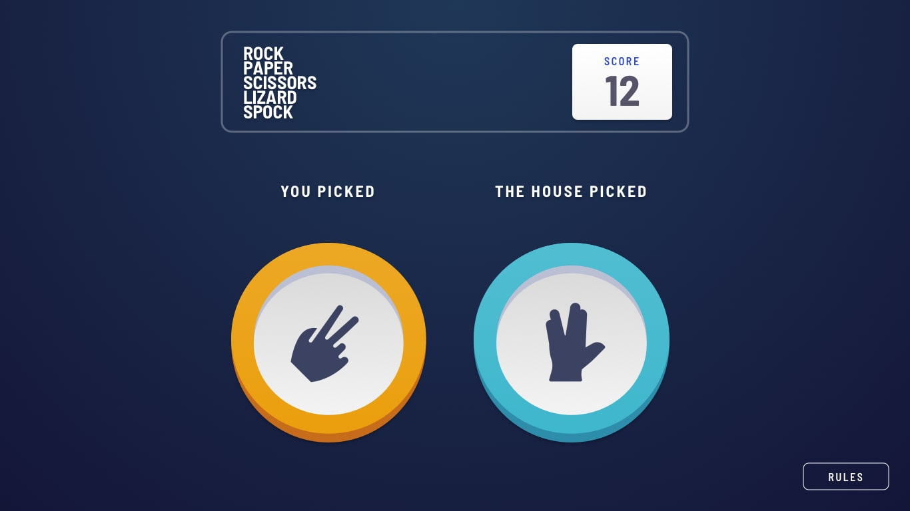

# Animated Rock, Paper, Scissors, Lizard, Spock solution

This is my solution to the BONUS version of [Rock, Paper, Scissors challenge on Frontend Mentor](https://www.frontendmentor.io/challenges/rock-paper-scissors-game-pTgwgvgH).

> [!IMPORTANT]
>
> - I did this challenge with the FREE subscription so I did NOT have the Figma file. I used a browser extension called Pixel Perfect Pro to superimpose the design images over the site to make a pixel perfect integration because I'm a details oriented person (nobody's perfect!)
> - I built the BONUS challenge version of this game with Lizard and Spock which is harder than the original version.
> - I worked 2 weeks on this project in order to write my entire thought process below. PLEASE take the time to read it, especially the last part about animations, you'll learn a lot as I did while building this project!

## Video demo

<video src="https://github.com/user-attachments/assets/0b59dbfa-4e04-4c20-9cb5-cb731ea36bc0"><video>

## Table of contents

- [The challenge](#the-challenge)
- [Links](#links)
- [Technologies used](#technologies-used)
- [Thought process](#thought-process)
  - [Step 1: Quick look at the designs](#step-1-quick-look-at-the-designs)
  - [Step 2: The header](#step-2-the-header)
  - [Step 3: The buttons group](#step-3-the-buttons-group)
  - [Step 4: The GODAMN buttons](#step-4-the-godamn-buttons)
  - [Step 5: The rules button](#step-5-the-rules-button)
  - [Step 6: The rules modal dialog](#step-6-the-rules-modal-dialog)
  - [Step 7: Clicking on a choice](#step-7-clicking-on-a-choice)
  - [Step 8: Make the house pick a choice](#step-8-make-the-house-pick-a-choice)
  - [Step 9: Compute winner and loser](#step-9-compute-winner-and-loser)
  - [Step 10: Update score and save it across sessions](#step-10-update-score-and-save-it-across-sessions)
  - [Step 11: Responsive design](#step-11-responsive-design)
  - [Step 12: Accessibility](#step-12-accessibility)
  - [Step 13: Fixing bugs related to exotic screen sizes](#step-13-fixing-bugs-related-to-exotic-screen-sizes)
  - [Step 14: Adding polish and some WOW effect on the project](#step-14-adding-polish-and-some-wow-effect-on-the-project)
- [Author](#author)

## The challenge

Users are able to:

- View the optimal layout for the game depending on their device's screen size
- Play Rock, Paper, Scissors, Lizard, Spock against the computer
- Maintain the state of the score after refreshing the browser

## Links

- Source code URL: [https://github.com/jeremymouzin/fem-rock-paper-scissors/](https://github.com/jeremymouzin/fem-rock-paper-scissors/)
- Live Site URL: [https://jeremymouzin.github.io/fem-rock-paper-scissors/](https://jeremymouzin.github.io/fem-rock-paper-scissors/)

## Technologies used

- Semantic HTML5 markup
- CSS custom properties with Flexbox and Grid
- Vanilla JavaScript
- Desktop-first workflow
- Google fonts
- No library, No framework, just pure HTML / CSS / JS 🚀

## Thought process

### Step 1: Quick look at the designs

I checked the desktop and mobile designs and decided that the structure would allow me to approach integration as usual with a top-bottom approach. Also I decided to work desktop-first based on these designs.

I started from the top of the design and built each piece one by one until I reach the bottom... starting with the header.

### Step 2: The header

After putting the background gradient to the body I started with the header. A logo at the left and the score at the right, flexbox with `space-between` will do the job nicely.

I had to adjust the logo position and paddings in the header because they're not exactly the same and I do pixel perfect designs you know. So I throwed a `position: relative; top: 4px;` on the logo to fit perfectly the design.

Also I had to add a `h1` tag for best practices so I decided to put one that is invisible (because nothing on the design seems relevant to be a title). I didn't add `aria-hidden` attribute so that ARIA technologies can use this information. I'm not an expert on accessibility, I'm still learning this part so feel free to correct me if I did something wrong here, thanks.

### Step 3: The buttons group

I started by adding the pentagon SVG image on the background of the div that will contain all buttons by using the `background-image` property. I centered everything according to the design using a combination of `margin-inline: auto` and `margin-block-start`. Nothing difficult here.

But then I looked further to the design and started wondering how the hell I'm gonna do these colored circles around each possible choice... with the shadows etc.

That's going to be a little challenge for me...

### Step 4: The GODAMN buttons

OK I spent waaaayy too much time on this, I'm sure having the Figma file would have helped the process a lot. Anyway, after playing with stacking `background` properties, trying to use `radial-gradient` and stuff I just used a simple `box-shadow` (with `inset`) and a `::before` pseudo-element to make it happen.

> Don't be fooled sometimes the easiest ways of doing things take a lot of time to figure out!

I heavily used CSS variables to make the thing more robust to change: for example, if you want to change the thickness of the colored border of the buttons for example, you just have to change one value `--thickness`.

I manually adjusted all icons to fit the design perfectly. I did this using Google Chrome Sources tab with workspaces folders feature which speeds up the process a lot by saving immediately to the file all your changes in the Chrome editor.

### Step 5: The rules button

No difficulty here to make and place the button.

### Step 6: The rules modal dialog

I used the awesome `dialog` element (with `::backdrop` pseudo-element!) to build the rules modal easily. I will check accessibility at the very end when all designs (mobile and desktop) will be integrated. I decided to use a flexbox container on the desktop version because I will need it for the mobile version too (I always check mobile and desktop designs to pick up the right layout for both if possible).

### Step 7: Clicking on a choice

I had to do lots of refactorings in the CSS to decouple properties from the buttons and to make classes that just generate the colored buttons and some others that put the correct image centered in it.

Also I had to manage toggling content when clicking on a choice to make the hexagon of choices disappears while the fight screen appears.

I didn't want the CSS to be tied to my JavaScript. For example, if the `div.fight` uses a `display: grid`, I don't want to have to write `fight.style.display = 'grid'` in my JavaScript to make it visible! Why?

Because if I change my CSS later (using flexbox for example) I'll have to update my JavaScript code! The CSS would be tied to the JavaScript and I don't like that.

That's why I pull dynamically each `display` property values at the beginning of my script (thanks to `getComputedStyle()`) and record them in a dictionary (`Map`). This way I can use later these values to make element appear / disappear properly. I built 2 little helper functions for that `makeAppear` and `makeDisappear` that I renamed later to `show` and `hide`.

Lastly, I used `data-*` attributes to pick the correct CSS class to apply when clicking on a button to make a choice. This way I don't rely on `class` attributes as they're related to styling elements, not storing data in any way.

### Step 8: Make the house pick a choice

I added some JavaScript so that the house can pick up a random choice. I did a quick animation of serveral choices like a kind of lottery. I did have a small problem, when 2 choices were the same it introduced a kind of lag in the animation so I fixed it by not allowing picking the same choice consecutively.

### Step 9: Compute winner and loser

I wrote a bit of JavaScript to compute the winner and added the circles shadows around the winner choice.
I wanted my code to be easy to read so I took the time to write a specific function so that I can write something like this:

```js
if (choice(userValue).beats(houseValue)) {
  resultLabelValue = 'you win'
}
```

Pretty easy to understand what this code does, right?

### Step 10: Update score and save it across sessions

Easy to do with JavaScript and localStorage 👍.

### Step 11: Responsive design

Making the responsive design was quite difficult even if I used the correct layout from the start based on my analysis of desktop and mobile designs versions. I tried to use the `transform: scale()` function to scale down the size of the pentagon with buttons but it created shifting issues when using 320px small wide screens!

So instead of scaling down the whole pentagon I just scaled down the buttons using a CSS variable `--scale-buttons` and it worked like a charm. I had to refactor a lot of CSS I did to avoid duplicating stuff.

Refactoring CSS is the best part because it helps you write less CSS in the end for the same result which is very satisfaying!

### Step 12: Accessibility

I'm not the best at accessibilty and have a learn to lot.

I run Lighthouse on Chrome to get some clues about what could be improved, thanks to this tool, I did some improvements:

- I added ARIA labels for buttons (paper, scissors etc.)
- I reorder the buttons so that when you select them with the keyboard, it turns in a clock-wise order which is more playful
- I used a bit of JavaScript to ease playing again and avoid useless typing:
  - When displaying results after a fight, the play again button is immediately focused, you just have to type ENTER and boom you can play again (otherwise you have to type on TAB and then ENTER)
  - When getting back to the make your choice layout, the first button at the top is immediately focused (selected) avoiding again the use of the TAB button and saving one more key stroke!

I had a 100 accessibility score on Lighthouse so I moved on but if I can improve, let me know, thanks.

### Step 13: Fixing bugs related to exotic screen sizes

I used the responsive tool in Google Chrome to stretch width and height of screen in whatever shape they can take and discovered lots of bugs that I fixed:

- Rules dialog image was stretching so much on some screen size (square size for example) that it covered title or close button
- Rules button could move above other buttons on some small screen sizes. To avoid it you must try to not pull out the button from the normal flow (even if your first idea seeing the design is to use an absolute positioning with some `inset-block-end` value! I did that mistake too!)
- Background was repeating itself on some big height screen sizes, I fixed it using `min-block-size` instead of hard `block-size` constraint

### Step 14: Adding polish and some WOW effect on the project

At this point, everything was working as expected. I could have stopped there but I would have the same website as everyone else!

So I decided to add some WOW effect by adding dynamic animations. My little touch you know.

> [!IMPORTANT]
>
> By dynamic animations I mean that if a designer moves the HTML elements to somewhere else (using CSS for example), the animations should still work without touching the JavaScript code because it computes the destination positions dynamically just after the user clicks.

This last part should be fun to build and should provoke a WOW effect on the user of the game. To do this I added :

- Some dotted colored outline on `:hover` and `:focus-visible` so that people navigating with keyboard can enjoy it too. I used `currentColor` property to make the color of the outline the same as the button.
- Some nice box shadows on the rules button when `hover` or `focus-visible` (I removed the default `outline` of the browser while making sure accessibility was still OK)
- A rounded red (same red as rock choice) `outline` for the close button in the rules dialog when using keyboard to select it
- A bounce effect on the play again button (starting after a small delay) with an hover/focus-visible effect (bouncing faster)
- A flying button animation when picking a choice + fade in / out from the hexagon choice to the fight layout => **THIS WAS A NIGHTMARE TO BUILD (see below)**
- An animation when the result is shown on desktop layout: user and house choices moves fast to the left and right to allow the result to appear in the middle
- 2 specific animations for draw and win/lose results. When the result is draw it appears from the top and slides to the bottom to its position with opacity rising. When the result is win/lost, each word comes from left and right from the screen with opacity rising too
- When you lose, the word "lose" kind of fall to make you feel sad 🤣

I could add other animations but I've been working on this for 2 weeks now so I say it's finished (otherwise I could continue forever).

Before going further, let me set some definitions here, the "make your choice" layout is this one:


You click on any button and then the "fight" layout should appear with the button you picked on the left, below the text "you picked" (let's call this element the "destination element"):



So as I said earlier, the flying button was a real NIGHTMARE to build: when you click on the button of your choice, the hexagon and all other buttons must nicely fade out while your button flies to the fight layout, reaching the position of the "destination element" (just below the "you picked" text).

I had to completely rewrite the way I managed the transitions between the "make your choice" layout (see `.buttons-group`) and the "fight" layout (see `.fight`).

Indeed, before working on animations, I used a very common way of switching layouts between them: I switched off one of the layout using `display: none` and switched on the other one using `show('.fight')`. Basically this function resets the `display` value to the original one used in the HTML, so it shows what you want to show by setting `display` to something else than `none`. Basically one layout is `display: none` and the other one not and vice-versa.

But because the button should fly from the "make your choice" layout to the "fight" layout, it was hard to build. Because it should move between 2 disconnected part of the HTML! Moreover it should do this dynamically, computing the position of the "destination element" just when clicking on the button. Moreover I wanted to do a fade out on the "make your choice" layout and a fade in on the "fight" layout.

I broke this animation in several parts to work on it:

1. Make the picked up button stay in place while "make your choice" layout fades out
2. Compute the destination element position
3. Move the button to the destination position with a nice animation
4. Fade in the fight layout

Part 1. was not easy but I quickly figured out a way to do it: I cloned the clicked button and appended it as a child on the `main` div and used `position: fixed` to move it freely across the screen. I had an issue though. Because some transformation & transition were used on this button, I couldn't retrieve the initial position of the button to clone it and put it at the right place on the screen, there were always a shift in the position returned by `getBoundingClientRect()`.

I had to cancel the transformation and transition before requesting its position with `getBoundingClientRect()` to get the correct values, hence the code:

```js
buttonClicked.style.transform = 'none'
buttonClicked.style.transition = 'none'
const { x: sourceX, y: sourceY } = buttonClicked.getBoundingClientRect()
buttonClicked.style.removeProperty('transform')
buttonClicked.style.removeProperty('transition')

// ...

// Let's clone the button to let the buttons-group intact and disappear nicely
const buttonCloned = buttonClicked.cloneNode()
buttonCloned.style.position = 'fixed'
buttonCloned.style.zIndex = 1
buttonCloned.style.insetInlineStart = `${sourceX}px`
buttonCloned.style.insetBlockStart = `${sourceY}px`
buttonCloned.classList.add('flying-button')
```

That worked and I could move the button anywhere on the screen, nice!

I could easily fade out the "make your choice" layout but I stumbled on an issue again.
Because my button moves while the "make your choice" fades out slowly, I could see the real button on the screen while my cloned button was flying away and I didn't want that. I want the user to feel that it's the button he picked that moves on the screen.

To do this I just removed the real button just after cloning it (using `display: none`). As soon as the make your choice layout disappears completely after the fade out I add back the real button to it so that I'm in a fresh state on this part ready for the next time I'll bring back this layout when clicking on the "play again" button.

OK, let's talk about the part 2 now. The hard one. The goal is to get the correct position of the "destination element" so that I can move my cloned button on the right part of the screen.

Let me recall you at this point that I use `display` property to make appear / disappear the layouts to switch between them.

I tried several things during a few days to achieve this part:

- As soon as the user clicks on the button, I switch off the current layout to bring the fight layout up, get the position of the destination element and switch back everything in place before starting the animation of the button. It worked BUT I always had a glitch when clicking on the button, a flickering. Of course to avoid to show the fight layout to user I put `visibility: hidden` on the fight layout before using `display` to show it. I learned I can still compute the position of an element if `display` is not `none` and `visibility` is `hidden`. But even with this, the make your choice layout disappears a fraction of a second and comes back, creating a flickering / glitch I wasn't satisfied about.
- I tried to compute the position of the destination element when the page is finished loading. This way I wouldn't have to switch on / off the layouts, I already had the destination position in a variable. It worked too and for some times I used this solution BUT if the user resizes the window, the position is not updated and it sends my flying button to the moon! Again, this solution didn't satisfy me.

If I wanted to be able to compute the destination element dynamically (at the very moment the user clicks) I needed a way to access the correct position without using `display` property / switch on/off layouts. So I had to rework the way my layouts were architectured.

I decided to put my make your choice layout `position: absolute`, this way my fight layout could have been underneath, at the right position and invisible, letting me access dynamically the destination element position at anytime without having to change the display (no glitch or flickering of any sort!).

And it WORKED! 🔥

After modifying everything to get the pixel perfect design I wanted, I could access the invisible destination element position and move my cloned button at this exact position! And the user could resize the window it didn't matter as the position was now computed when he clicked. The only way to break the animation is to resize the window right after clicking the button which would be quite difficult to do (and who would do this anyway?).

So if you're wondering why my make your choices layout is absolutely positioned, now you know!

Part 3 and 4 were pretty straightforward, I did ensure to make smooth animations using Animation Events API and specically the events `animationstart` and `animationend` to orchestrate everything as I wanted.

Doing such animations is like being a conductor!

Feel free to take a trip in the past using specific commits in this repo, I commited every things I tried to keep a trace if someone wanted to know each step of the process.

I learned a lot during this project, I have lots of other ideas to animate elements but I'll let it rest for now.

Feel free to reach to me if you have some work or if you just want to talk.

I'm french by the way! 🥖👨‍🎨🗼🇫🇷

Cheers!

## Author

- My JavaScript Course website - [JavaScript de Zéro](https://www.javascriptdezero.com)
- Frontend Mentor Profile - [@jeremymouzin](https://www.frontendmentor.io/profile/jeremymouzin)
- X/Twitter - [@jeremymouzin](https://x.com/jeremymouzin)
